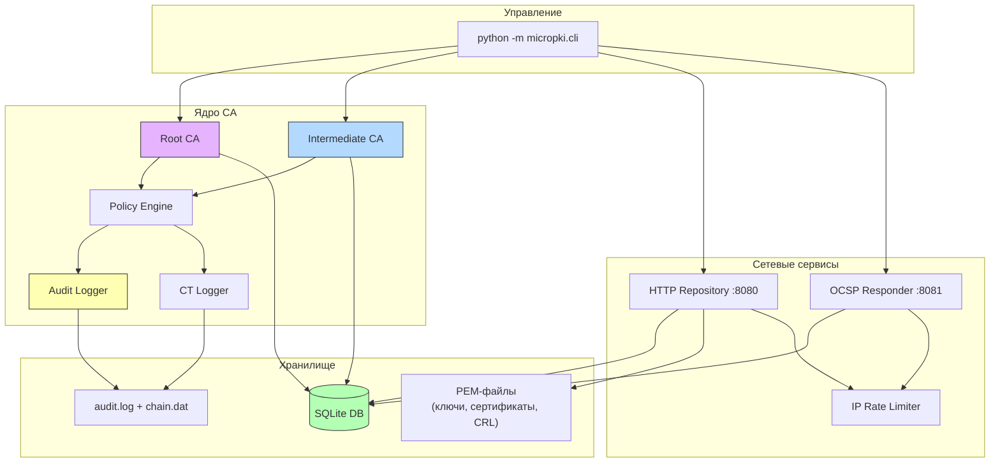

# MicroPKI

Учебная реализация инфраструктуры публичных ключей (PKI) на Python. Проект охватывает полный жизненный цикл X.509 сертификатов: от инициализации корневого удостоверяющего центра до онлайн-проверки статуса через OCSP.

## Содержание

- [Возможности](#возможности)
- [Архитектура](#архитектура)
- [Установка](#установка)
- [Быстрый старт](#быстрый-старт)
- [Справочник команд](#справочник-команд)
  - [Управление CA](#управление-ca)
  - [Выпуск сертификатов](#выпуск-сертификатов)
  - [Отзыв и CRL](#отзыв-и-crl)
  - [Клиентские команды](#клиентские-команды)
  - [OCSP Responder](#ocsp-responder)
  - [HTTP Repository](#http-repository)
  - [База данных](#база-данных)
  - [Контейнеры PKCS#12](#контейнеры-pkcs12)
  - [Аудит](#аудит)
- [API репозитория](#api-репозитория)
- [OCSP Responder API](#ocsp-responder-api)
- [Политики безопасности](#политики-безопасности)
- [Система аудита](#система-аудита)
- [Certificate Transparency](#certificate-transparency)
- [Rate Limiting](#rate-limiting)
- [Компрометация ключей](#компрометация-ключей)
- [Демонстрация](#демонстрация)
- [Тестирование](#тестирование)
- [Структура проекта](#структура-проекта)
- [Известные ограничения](#известные-ограничения)

## Возможности

- Инициализация Root CA и выпуск Intermediate CA с поддержкой RSA 4096 и ECC P-384
- Шаблоны сертификатов: `server`, `client`, `code_signing`
- Subject Alternative Names (DNS, IP, Email, URI)
- Генерация CRL v2 (RFC 5280) с автоматическим кэшированием
- OCSP Responder с выделенным сертификатом подписи
- Клиентские инструменты: генерация CSR, запрос сертификата через HTTP API, валидация цепочки
- Проверка статуса отзыва с автоматическим fallback OCSP → CRL
- SQLite база данных для хранения выпущенных сертификатов и серийных номеров
- HTTP репозиторий для распространения сертификатов, CRL и приема CSR
- Аудит операций с SHA-256 хеш-цепочкой
- Симуляция Certificate Transparency
- Rate Limiting на базе Token Bucket для защиты серверов
- Механизм компрометации CA-ключей
- Экспорт/импорт CA в контейнеры PKCS#12 для офлайн-хранения

## Архитектура



## Установка

### Требования

- Python 3.10+
- pip

### Пошаговая установка

```bash
# Клонирование
git clone https://github.com/dmortyanov/micropki
cd micropki

# Создание виртуального окружения
python -m venv venv

# Активация (Windows)
.\venv\Scripts\activate

# Активация (Linux/macOS)
source venv/bin/activate

# Установка зависимостей
pip install -r requirements.txt
```

### Зависимости

| Пакет | Версия | Назначение |
|-------|--------|------------|
| `cryptography` | >= 43.0 | X.509, OCSP, генерация ключей |
| `PyYAML` | >= 6.0 | Конфигурация |
| `pytest` | >= 8.0 | Тестирование |
| `pytest-cov` | >= 5.0 | Покрытие кода |

## Быстрый старт

Запустите полную автоматическую демонстрацию, которая создаст PKI-иерархию, выпустит сертификаты, запустит серверы, проверит отзыв и валидацию:

```bash
python demo.py
```

Или выполните шаги вручную:

```bash
# 1. Подготовить файл с паролем
echo "MySecretPass" > root_pass.txt
echo "InterPass123" > inter_pass.txt

# 2. Инициализировать Root CA
python -m micropki.cli ca init \
  --subject "CN=My Root CA,O=MyOrg,C=RU" \
  --key-type rsa --key-size 4096 \
  --passphrase-file root_pass.txt \
  --out-dir ./pki

# 3. Выпустить Intermediate CA
python -m micropki.cli ca issue-intermediate \
  --root-cert ./pki/certs/ca.cert.pem \
  --root-key ./pki/private/ca.key.pem \
  --root-pass-file root_pass.txt \
  --subject "CN=My Intermediate CA,O=MyOrg,C=RU" \
  --key-type rsa --key-size 4096 \
  --passphrase-file inter_pass.txt \
  --out-dir ./pki

# 4. Выпустить серверный сертификат
python -m micropki.cli ca issue-cert \
  --ca-cert ./pki/certs/intermediate.cert.pem \
  --ca-key ./pki/private/intermediate.key.pem \
  --ca-pass-file inter_pass.txt \
  --template server \
  --subject "CN=example.local" \
  --san dns:example.local --san dns:www.example.local \
  --out-dir ./pki/certs

# 5. Проверить целостность аудита
python -m micropki.cli audit verify --log-file ./pki/audit.log
```

## Справочник команд

Все команды вызываются через `python -m micropki.cli`. Справка по любой команде: `python -m micropki.cli <command> <action> --help`.

### Управление CA

#### `ca init` — Инициализация корневого CA

Создает самоподписанный сертификат Root CA и структуру директорий PKI.

```bash
python -m micropki.cli ca init \
  --subject "CN=Root CA,O=Example,C=RU" \
  --key-type rsa \
  --key-size 4096 \
  --passphrase-file root_pass.txt \
  --out-dir ./pki \
  --validity-days 3650 \
  --force
```

| Параметр | Обязательный | По умолчанию | Описание |
|----------|:-----------:|:------------:|----------|
| `--subject` | да | — | Distinguished Name (DN) |
| `--key-type` | нет | `rsa` | Алгоритм: `rsa` или `ecc` |
| `--key-size` | нет | `4096` | Размер ключа (RSA: 4096, ECC: 384) |
| `--passphrase-file` | да | — | Файл с паролем для шифрования ключа |
| `--out-dir` | нет | `./pki` | Директория для записи файлов |
| `--validity-days` | нет | `3650` | Срок действия в днях |
| `--force` | нет | `false` | Перезаписать существующие файлы |
| `--log-file` | нет | stderr | Путь к файлу логов |

#### `ca issue-intermediate` — Создание промежуточного CA

```bash
python -m micropki.cli ca issue-intermediate \
  --root-cert ./pki/certs/ca.cert.pem \
  --root-key ./pki/private/ca.key.pem \
  --root-pass-file root_pass.txt \
  --subject "CN=Intermediate CA,O=Example,C=RU" \
  --key-type rsa --key-size 4096 \
  --passphrase-file inter_pass.txt \
  --out-dir ./pki \
  --pathlen 0
```

| Параметр | Обязательный | По умолчанию | Описание |
|----------|:-----------:|:------------:|----------|
| `--root-cert` | да | — | Сертификат Root CA |
| `--root-key` | да | — | Закрытый ключ Root CA |
| `--root-pass-file` | да | — | Файл с паролем Root CA |
| `--subject` | да | — | DN промежуточного CA |
| `--passphrase-file` | да | — | Файл с паролем для Intermediate CA |
| `--pathlen` | нет | `0` | Ограничение длины пути (Basic Constraints) |
| `--validity-days` | нет | `1825` | Срок действия (5 лет) |

### Выпуск сертификатов

#### `ca issue-cert` — Выпуск конечного сертификата

Поддерживает шаблоны `server`, `client`, `code_signing`. Может использовать внешний CSR.

```bash
# Серверный сертификат с SAN
python -m micropki.cli ca issue-cert \
  --ca-cert ./pki/certs/intermediate.cert.pem \
  --ca-key ./pki/private/intermediate.key.pem \
  --ca-pass-file inter_pass.txt \
  --template server \
  --subject "CN=myapp.example.com" \
  --san dns:myapp.example.com --san dns:api.example.com \
  --out-dir ./pki/certs \
  --validity-days 365

# Клиентский сертификат
python -m micropki.cli ca issue-cert \
  --ca-cert ./pki/certs/intermediate.cert.pem \
  --ca-key ./pki/private/intermediate.key.pem \
  --ca-pass-file inter_pass.txt \
  --template client \
  --subject "CN=user@example.com" \
  --out-dir ./pki/certs

# Code Signing сертификат
python -m micropki.cli ca issue-cert \
  --ca-cert ./pki/certs/intermediate.cert.pem \
  --ca-key ./pki/private/intermediate.key.pem \
  --ca-pass-file inter_pass.txt \
  --template code_signing \
  --subject "CN=Release Signer" \
  --out-dir ./pki/certs

# Выпуск на основе внешнего CSR
python -m micropki.cli ca issue-cert \
  --ca-cert ./pki/certs/intermediate.cert.pem \
  --ca-key ./pki/private/intermediate.key.pem \
  --ca-pass-file inter_pass.txt \
  --template server \
  --subject "CN=external.local" \
  --csr ./external.csr.pem \
  --out-dir ./pki/certs
```

| Параметр | Обязательный | По умолчанию | Описание |
|----------|:-----------:|:------------:|----------|
| `--ca-cert` | да | — | Сертификат подписывающего CA |
| `--ca-key` | да | — | Закрытый ключ подписывающего CA |
| `--ca-pass-file` | да | — | Пароль CA |
| `--template` | да | — | Шаблон: `server`, `client`, `code_signing` |
| `--subject` | да | — | DN сертификата |
| `--san` | нет | — | SAN (повторяемый: `dns:`, `ip:`, `email:`, `uri:`) |
| `--csr` | нет | — | Путь к внешнему CSR (PKCS#10) |
| `--out-dir` | нет | `./pki/certs` | Директория для записи |
| `--validity-days` | нет | `365` | Срок действия |

#### `ca issue-ocsp-cert` — Выпуск сертификата OCSP Responder

Создает сертификат с расширением `id-kp-OCSPSigning`.

```bash
python -m micropki.cli ca issue-ocsp-cert \
  --ca-cert ./pki/certs/intermediate.cert.pem \
  --ca-key ./pki/private/intermediate.key.pem \
  --ca-pass-file inter_pass.txt \
  --subject "CN=OCSP Responder" \
  --key-type rsa --key-size 2048 \
  --out-dir ./pki/certs
```

#### `ca validate-chain` — Проверка цепочки доверия

```bash
python -m micropki.cli ca validate-chain \
  --cert ./pki/certs/myapp.example.com.cert.pem \
  --intermediate ./pki/certs/intermediate.cert.pem \
  --root ./pki/certs/ca.cert.pem
```

#### `ca list-certs` — Список выпущенных сертификатов

```bash
# Таблица (по умолчанию)
python -m micropki.cli ca list-certs

# Фильтр по статусу, вывод в JSON
python -m micropki.cli ca list-certs --status valid --format json

# CSV для экспорта
python -m micropki.cli ca list-certs --format csv
```

#### `ca show-cert` — Вывод PEM сертификата по серийному номеру

```bash
python -m micropki.cli ca show-cert <SERIAL_HEX>
```

### Контейнеры PKCS#12

Формат PKCS#12 (`.p12` / `.pfx`) объединяет сертификат и закрытый ключ в единый зашифрованный контейнер. Это стандартный способ безопасного хранения учётных данных CA на внешних носителях (USB-накопителях).

#### `ca export` — Экспорт CA в контейнер PKCS#12

Упаковывает сертификат и закрытый ключ CA в защищённый паролем файл `.p12`.

```bash
# Подготовить пароль для контейнера
echo "ContainerPassword" > p12_pass.txt

# Экспортировать Root CA
python -m micropki.cli ca export \
  --ca-cert ./pki/certs/ca.cert.pem \
  --ca-key ./pki/private/ca.key.pem \
  --ca-pass-file root_pass.txt \
  --out-p12 ./backup/root_ca.p12 \
  --p12-pass-file p12_pass.txt \
  --friendly-name "Production Root CA"

# Экспортировать Intermediate CA
python -m micropki.cli ca export \
  --ca-cert ./pki/certs/intermediate.cert.pem \
  --ca-key ./pki/private/intermediate.key.pem \
  --ca-pass-file inter_pass.txt \
  --out-p12 ./backup/intermediate_ca.p12 \
  --p12-pass-file p12_pass.txt
```

| Параметр | Обязательный | По умолчанию | Описание |
|----------|:-----------:|:------------:|----------|
| `--ca-cert` | да | — | Сертификат CA (PEM) |
| `--ca-key` | да | — | Закрытый ключ CA (PEM, зашифрованный) |
| `--ca-pass-file` | да | — | Файл с паролем от ключа CA |
| `--out-p12` | да | — | Путь к выходному файлу `.p12` |
| `--p12-pass-file` | да | — | Файл с паролем для контейнера |
| `--friendly-name` | нет | `MicroPKI CA` | Метка внутри контейнера |
| `--log-file` | нет | stderr | Путь к файлу логов |

#### `ca import` — Импорт CA из контейнера PKCS#12

Восстанавливает PEM-файлы (сертификат и зашифрованный ключ) из контейнера `.p12`.

```bash
# Подготовить новый пароль для ключа
echo "NewKeyPassword" > new_pass.txt

# Восстановить Root CA
python -m micropki.cli ca import \
  --in-p12 ./backup/root_ca.p12 \
  --p12-pass-file p12_pass.txt \
  --new-pass-file new_pass.txt \
  --out-dir ./pki

# Восстановить Intermediate CA
python -m micropki.cli ca import \
  --in-p12 ./backup/intermediate_ca.p12 \
  --p12-pass-file p12_pass.txt \
  --new-pass-file new_pass.txt \
  --out-dir ./pki \
  --prefix intermediate
```

| Параметр | Обязательный | По умолчанию | Описание |
|----------|:-----------:|:------------:|----------|
| `--in-p12` | да | — | Входной файл `.p12` |
| `--p12-pass-file` | да | — | Файл с паролем контейнера |
| `--new-pass-file` | да | — | Файл с новым паролем для PEM-ключа |
| `--out-dir` | нет | `./pki` | Базовая директория PKI |
| `--prefix` | нет | `ca` | Префикс файлов: `ca`, `intermediate` |
| `--log-file` | нет | stderr | Путь к файлу логов |

> **Сценарий использования**: после `ca init` экспортируйте Root CA на USB-накопитель и удалите оригинальные PEM-файлы. При необходимости подписать новый промежуточный CA — импортируйте обратно.

### Отзыв и CRL

#### `ca revoke` — Отзыв сертификата

```bash
# С подтверждением
python -m micropki.cli ca revoke <SERIAL_HEX> --reason keyCompromise

# Без подтверждения
python -m micropki.cli ca revoke <SERIAL_HEX> --reason cessationOfOperation --force
```

Допустимые причины: `unspecified`, `keyCompromise`, `caCompromise`, `affiliationChanged`, `superseded`, `cessationOfOperation`.

#### `ca gen-crl` — Генерация CRL

```bash
# CRL для Intermediate CA
python -m micropki.cli ca gen-crl --ca intermediate --next-update 7

# CRL для Root CA
python -m micropki.cli ca gen-crl --ca root --next-update 30

# Указать конкретный выходной файл
python -m micropki.cli ca gen-crl --ca intermediate --out-file ./output/my.crl.pem
```

| Параметр | Обязательный | По умолчанию | Описание |
|----------|:-----------:|:------------:|----------|
| `--ca` | да | — | `root`, `intermediate` или путь к CA-сертификату |
| `--next-update` | нет | `7` | Дней до следующего обновления CRL |
| `--out-dir` | нет | `./pki` | Базовая директория PKI |
| `--out-file` | нет | авто | Путь к выходному файлу |
| `--ca-pass-file` | нет | авто | Пароль CA (переопределение) |

#### `ca check-revoked` — Проверка статуса в БД

```bash
python -m micropki.cli ca check-revoked <SERIAL_HEX>
```

Код возврата: `0` — валиден, `2` — отозван.

### Клиентские команды

#### `client gen-csr` — Генерация CSR

Создает пару ключей и запрос на подпись сертификата.

```bash
python -m micropki.cli client gen-csr \
  --subject "CN=webapp.local,O=Dev,C=RU" \
  --key-type rsa --key-size 4096 \
  --san dns:webapp.local --san dns:www.webapp.local \
  --out-key webapp.key.pem \
  --out-csr webapp.csr.pem
```

| Параметр | Обязательный | По умолчанию | Описание |
|----------|:-----------:|:------------:|----------|
| `--subject` | да | — | DN субъекта |
| `--key-type` | нет | `rsa` | Алгоритм: `rsa` / `ecc` |
| `--key-size` | нет | `2048` | Размер ключа |
| `--san` | нет | — | SAN (повторяемый) |
| `--out-key` | да | — | Путь для сохранения закрытого ключа |
| `--out-csr` | да | — | Путь для сохранения CSR |

#### `client request-cert` — Запрос сертификата через HTTP API

Отправляет CSR на сервер репозитория и получает подписанный сертификат.

```bash
python -m micropki.cli client request-cert \
  --csr webapp.csr.pem \
  --template server \
  --ca-url http://localhost:8080 \
  --out-cert webapp.cert.pem
```

#### `client validate` — Валидация пути сертификата

Строит и проверяет цепочку доверия от leaf-сертификата до корневого.

```bash
# Проверка только пути
python -m micropki.cli client validate \
  --cert webapp.cert.pem \
  --untrusted ./pki/certs/intermediate.cert.pem \
  --trusted ./pki/certs/ca.cert.pem \
  --mode path

# Полная проверка (путь + статус отзыва)
python -m micropki.cli client validate \
  --cert webapp.cert.pem \
  --untrusted ./pki/certs/intermediate.cert.pem \
  --trusted ./pki/certs/ca.cert.pem \
  --mode full \
  --ocsp-url http://localhost:8081/ocsp
```

#### `client check-status` — Проверка статуса отзыва

Проверяет статус сертификата через OCSP (приоритет) или CRL (fallback).

```bash
# Через OCSP
python -m micropki.cli client check-status \
  --cert webapp.cert.pem \
  --ca-cert ./pki/certs/intermediate.cert.pem \
  --ocsp-url http://localhost:8081/ocsp

# Через CRL
python -m micropki.cli client check-status \
  --cert webapp.cert.pem \
  --ca-cert ./pki/certs/intermediate.cert.pem \
  --crl ./pki/crl/intermediate.crl.pem
```

Результат: `GOOD`, `REVOKED` (код возврата 2), `UNKNOWN`.

### OCSP Responder

#### `ocsp serve` — Запуск OCSP сервера

```bash
python -m micropki.cli ocsp serve \
  --host 127.0.0.1 --port 8081 \
  --db-path ./pki/micropki.db \
  --responder-cert ./pki/certs/OCSP_Responder.cert.pem \
  --responder-key ./pki/certs/OCSP_Responder.key.pem \
  --ca-cert ./pki/certs/intermediate.cert.pem \
  --cache-ttl 60 \
  --rate-limit 100 --rate-burst 50
```

| Параметр | Обязательный | По умолчанию | Описание |
|----------|:-----------:|:------------:|----------|
| `--host` | нет | `127.0.0.1` | Адрес привязки |
| `--port` | нет | `8081` | TCP-порт |
| `--db-path` | нет | `./pki/micropki.db` | Путь к SQLite БД |
| `--responder-cert` | да | — | Сертификат OCSP Responder |
| `--responder-key` | да | — | Закрытый ключ OCSP Responder (незашифрованный) |
| `--ca-cert` | да | — | Сертификат подписавшего CA |
| `--cache-ttl` | нет | `60` | TTL кэша ответов (секунды) |
| `--rate-limit` | нет | `100` | Токенов в секунду |
| `--rate-burst` | нет | `50` | Максимальный размер ведра |

### HTTP Repository

#### `repo serve` — Запуск HTTP сервера репозитория

```bash
python -m micropki.cli repo serve \
  --host 127.0.0.1 --port 8080 \
  --db-path ./pki/micropki.db \
  --cert-dir ./pki/certs \
  --rate-limit 100 --rate-burst 50
```

| Параметр | Обязательный | По умолчанию | Описание |
|----------|:-----------:|:------------:|----------|
| `--host` | нет | `127.0.0.1` | Адрес привязки |
| `--port` | нет | `8080` | TCP-порт |
| `--db-path` | нет | `./pki/micropki.db` | Путь к SQLite БД |
| `--cert-dir` | нет | `./pki/certs` | Директория с PEM-файлами |
| `--rate-limit` | нет | `100` | Токенов в секунду |
| `--rate-burst` | нет | `50` | Размер ведра |

#### `repo status` — Проверка доступности

```bash
python -m micropki.cli repo status --host 127.0.0.1 --port 8080
```

### База данных

#### `db init` — Инициализация схемы SQLite

```bash
python -m micropki.cli db init --db-path ./pki/micropki.db
```

### Аудит

#### `audit verify` — Проверка целостности журнала

```bash
python -m micropki.cli audit verify --log-file ./pki/audit.log
```

При успехе: `SUCCESS: Audit log is valid and untampered.`

## API репозитория

HTTP-сервер репозитория предоставляет следующие эндпоинты:

| Метод | Путь | Описание |
|-------|------|----------|
| GET | `/certificate/<serial_hex>` | Получить PEM сертификата по серийному номеру |
| GET | `/ca/root` | Получить сертификат Root CA |
| GET | `/ca/intermediate` | Получить сертификат Intermediate CA |
| GET | `/crl` | Получить текущий CRL (по умолчанию — intermediate) |
| GET | `/crl?ca=root` | Получить CRL для Root CA |
| POST | `/request-cert?template=server` | Отправить CSR и получить подписанный сертификат |

### POST `/request-cert`

Требует заголовок `X-API-Key`. Тело запроса — PEM-encoded CSR.

```bash
curl -X POST http://localhost:8080/request-cert?template=server \
  -H "Content-Type: application/x-pem-file" \
  -H "X-API-Key: changeme" \
  --data-binary @my.csr.pem \
  -o signed.cert.pem
```

При превышении rate limit сервер возвращает `429 Too Many Requests`.

## OCSP Responder API

| Метод | Путь | Content-Type | Описание |
|-------|------|:-------------|----------|
| POST | `/` или `/ocsp` | `application/ocsp-request` | OCSP-запрос (DER) |

Ответ: `application/ocsp-response` (DER).

```bash
# Пример с openssl
openssl ocsp -issuer intermediate.cert.pem \
  -cert server.cert.pem \
  -url http://localhost:8081/ocsp \
  -resp_text
```

## Политики безопасности

Модуль `policy.py` проверяет каждый выпускаемый сертификат перед подписанием:

| Проверка | Правило | Действие при нарушении |
|----------|---------|------------------------|
| Размер ключа RSA | >= 2048 бит | Отказ + запись в аудит |
| Размер ключа ECC | >= 256 бит | Отказ + запись в аудит |
| Срок действия | <= 398 дней | Отказ + запись в аудит |
| Wildcard SAN | Запрещен (`*.domain`) | Отказ + запись в аудит |

## Система аудита

Журнал аудита хранится в формате NDJSON (`audit.log`). Каждая запись содержит:

```json
{
  "ts": "2026-04-18T12:00:00.000Z",
  "action": "issue_certificate",
  "details": {"serial": "AB12...", "subject": "CN=example.com"},
  "hash": "9d289403d622..."
}
```

### Хеш-цепочка (Hash-chaining)

Целостность журнала обеспечивается алгоритмом цепочки хешей:
1. Начальное значение (`seed`): `SHA-256("MicroPKI_START")`.
2. Для каждой записи: `new_hash = SHA-256(prev_hash || record_bytes)`.
3. Текущий хеш хранится в `chain.dat`.
4. Команда `audit verify` пересчитывает всю цепочку и сравнивает с `chain.dat`.

## Certificate Transparency

При каждом выпуске сертификата создается запись в CT-логе (`ct.log`):

```json
{"timestamp": "2026-04-18T12:00:00Z", "serial_number": "AB12...", "subject": "CN=...", "issuer": "CN=..."}
```

## Rate Limiting

Серверы `repo serve` и `ocsp serve` защищены от перегрузки механизмом Token Bucket:

- `--rate-limit` — скорость пополнения ведра (токенов/сек)
- `--rate-burst` — максимальный размер ведра

Ограничение применяется **per-IP**. При исчерпании токенов сервер возвращает `429 Too Many Requests`.

## Компрометация ключей

#### `ca compromise` — Отметка CA как скомпрометированного

```bash
python -m micropki.cli ca compromise <SERIAL_HEX> --force
```

Действие: отзыв с причиной `caCompromise` + запись в аудит.

## Демонстрация

Скрипт `demo.py` автоматически выполняет полный цикл:

1. Инициализация Root CA и Intermediate CA
2. Выпуск серверного, клиентского и OCSP-сертификатов
3. Запуск HTTP Repository и OCSP Responder
4. Валидация цепочки сертификатов
5. Отзыв серверного сертификата
6. Проверка отзыва через OCSP
7. Верификация целостности журнала аудита

```bash
python demo.py
```

Скрипт создает временную рабочую директорию, которая автоматически удаляется после завершения.

## Тестирование

```bash
# Все тесты
python -m pytest

# С отчетом о покрытии
python -m pytest --cov=micropki

# Конкретный набор тестов
python -m pytest tests/test_sprint5.py -v

# Нагрузочный тест (1000 сертификатов)
python -m pytest tests/test_performance.py -v
```

## Структура проекта

```
micropki/
├── micropki/                         # Основной пакет
│   ├── __init__.py                   # Версия пакета
│   ├── __main__.py                   # Точка входа (python -m micropki)
│   ├── audit.py                      # Аудит с SHA-256 хеш-цепочкой
│   ├── ca.py                         # Логика Root CA и Intermediate CA
│   ├── certificates.py               # Генерация и загрузка X.509
│   ├── chain.py                      # Валидация цепочек (RFC 5280)
│   ├── cli.py                        # Парсер CLI и диспетчер команд
│   ├── client.py                     # Клиентские инструменты
│   ├── config.py                     # Управление конфигурацией (YAML)
│   ├── crl.py                        # Генерация и подпись CRL v2
│   ├── crypto_utils.py               # Генерация ключей, PEM I/O, DN
│   ├── csr.py                        # CSR (PKCS#10)
│   ├── database.py                   # SQLite: хранение сертификатов
│   ├── logger.py                     # Логирование (stderr/file)
│   ├── ocsp.py                       # OCSP-протокол: запросы и ответы
│   ├── ocsp_responder.py             # HTTP OCSP-сервер
│   ├── policy.py                     # Принудительные политики безопасности
│   ├── ratelimit.py                  # Token Bucket rate limiter (per-IP)
│   ├── repository.py                 # HTTP-репозиторий сертификатов
│   ├── revocation.py                 # Логика отзыва
│   ├── revocation_check.py           # Проверка отзыва (OCSP → CRL fallback)
│   ├── serial.py                     # Генератор серийных номеров
│   ├── templates.py                  # Шаблоны профилей и парсинг SAN
│   └── transparency.py              # Симуляция CT-логов
├── tests/                            # Тесты
│   ├── conftest.py                   # Общие фикстуры pytest
│   ├── test_ca.py                    # Тесты Root CA
│   ├── test_certificates.py          # Тесты генерации сертификатов
│   ├── test_chain.py                 # Тесты валидации цепочки
│   ├── test_cli.py                   # Тесты CLI (Sprint 1)
│   ├── test_cli_sprint2.py           # Тесты CLI (Sprint 2)
│   ├── test_client_logic.py          # Тесты клиентской логики
│   ├── test_crypto_utils.py          # Тесты криптоутилит
│   ├── test_csr.py                   # Тесты CSR
│   ├── test_intermediate.py          # Тесты Intermediate CA
│   ├── test_performance.py           # Нагрузочный тест (1000 сертификатов)
│   ├── test_sprint3_db_cli.py        # Тесты БД
│   ├── test_sprint3_repository_api.py # Тесты HTTP-репозитория
│   ├── test_sprint3_serial_uniqueness.py # Тесты серийных номеров
│   ├── test_sprint4.py               # Тесты отзыва и CRL
│   ├── test_sprint5.py               # Тесты OCSP
│   └── test_templates.py             # Тесты шаблонов и SAN
├── demo.py                           # Автоматическая демонстрация
├── requirements.txt                  # Зависимости Python
├── pytest.ini                        # Конфигурация pytest
└── README.md                         # Этот файл
```

## Известные ограничения

- Закрытые ключи конечных сертификатов хранятся без шифрования
- OCSP Responder работает по HTTP (без TLS)
- CT-лог является симуляцией (нет дерева Меркла)
- Rate limiting не защищает от распределенных атак
- Аудит-лог защищен хеш-цепочкой, но файл не подписан цифровой подписью
- Система предназначена для учебных целей и не рекомендуется для production

---

**MicroPKI v1.0.0** — Проект по прикладной криптографии (Семестр 3).
